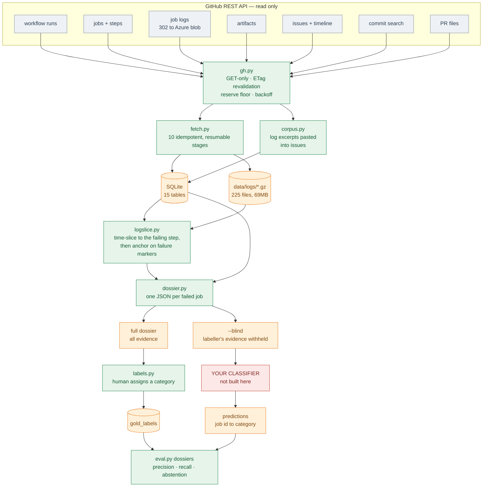
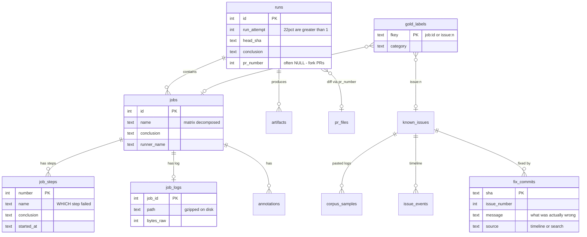
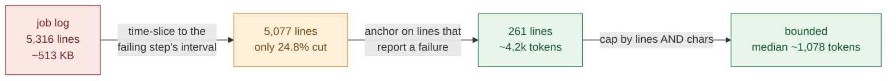
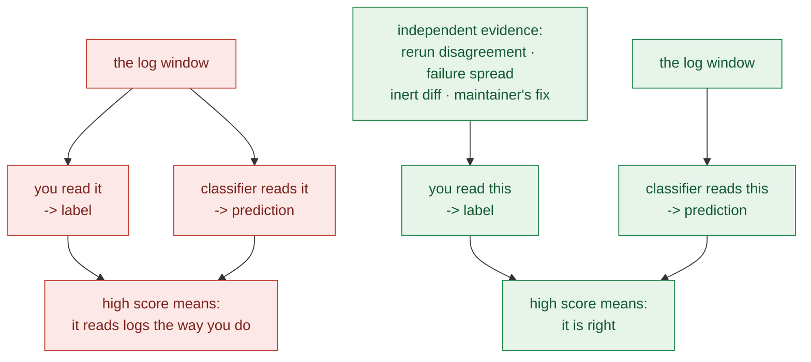
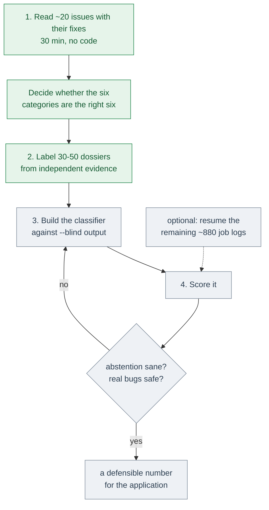

# podman-flake-agent — handbook

The front door. Everything you need to understand what this is, what it knows,
what it cannot know, and what to do next.

Other docs stay authoritative on their own topics and are linked where relevant:
[`DOSSIER.md`](DOSSIER.md) (the JSON contract) ·
[`FETCH_AUDIT.md`](FETCH_AUDIT.md) (API surface and limits) ·
[`LOG_ANATOMY.md`](LOG_ANATOMY.md) (what CI output actually looks like) ·
[`MAP.md`](MAP.md) (how the project got here) ·
[`plans/`](plans/) (every approved plan, in order).

*Current as of commit `8d825a8`. Every figure below was measured, not estimated.*

---

## 1. Orientation

### What this is

A data layer for triaging flaky tests in [Podman](https://github.com/podman-container-tools/podman)'s
CI, built for [LFX Mentorship issue #29265](https://github.com/podman-container-tools/podman/issues/29265) —
*"Agentic CI Flake Categorization and Analysis"*, mentored by Paul Holzinger
(@Luap99), Tim Zhou (@timcoding1988) and Mohan Boddu (@mohanboddu).

It fetches everything GitHub will give you about a failed CI job, narrows a
500 KB log to roughly a thousand tokens, and emits one self-contained JSON
document per failure. **It does not classify anything.** That boundary is
deliberate and is the subject of §8.

### State at a glance

| | |
|---|---|
| Code | 4,268 lines, 12 modules, **zero third-party dependencies** |
| Data window | 2026-06-30 → 2026-07-30 (30 days) |
| Runs | 492 |
| Jobs | 22,335 |
| Job steps | 153,425 |
| **Failed jobs** | **1,104** |
| Job logs stored | 225 (640 MB raw → 69 MB gzipped, **10.8%**) |
| Dossiers | 400 generated · 5 committed as offline fixtures |
| Flake issues | 372, of which **242 (65%)** have an identified fix |
| Ground-truth labels | **0** — this is the gap |
| Accuracy measured | **None.** By design; see §8 |

### The one-paragraph version

Podman's CI fails constantly, and most failures are flakes rather than real
bugs. Telling them apart is currently a human reading a bar graph. This project
makes that judgement *possible to automate* by assembling the evidence — which
step failed, what the log says, whether the same commit passed on a rerun,
whether the diff could even have caused it, whether a maintainer already fixed
it — into one document per failure. Whether to automate the judgement, and how,
is the next stage and is not built here.

---

## 2. The problem, in Podman's own words

This is not an invented problem. `CONTRIBUTING.md:355` documents the process:

> Most notably, the tests will occasionally flake. If you see a single test on
> your PR has failed, and you do not believe it is caused by your changes, you
> can rerun the tests.
>
> **Alternating red/green bars is indicative of a testing "flake", and should be
> examined (anybody can do this)**

and then hand-codes the heuristics:

| Pattern | Podman's documented reading |
|---|---|
| One or a few tests, one task | "Frequently the cause is networking or a brief external service outage" |
| Multiple tasks failing | "Logically this should be due to some shared/common element" |
| All tasks failing | "may be early indication of a more serious problem" |

That taxonomy is almost exactly the `infra_blip` / `race_condition` /
`network_timeout` split the mentorship describes. The work is turning a
documented manual heuristic into a reliable automated one.

`REVIEWING.md:24` separately asks every reviewer to check failures against known
flakes by hand.

### Why now

Podman migrated off Cirrus CI in **May 2026** (commit `3743b9f806`, *"Goodbye
Cirrus"*). That orphaned `hack/ci/logformatter` — the 38 KB Perl script that
classified every subtest as pass/fail/skip/**FLAKEY**. It is keyed entirely to
`CIRRUS_TASK_ID` and is invoked by no workflow; the only surviving reference is a
stale comment at `Makefile:726`.

**Podman currently has no automated flake classification at all.** PR
[#29091](https://github.com/podman-container-tools/podman/pull/29091) (open) is
Luap99 rebuilding part of it by hand, in Python.

---

## 3. Architecture



Red is the piece you build. Everything else exists.

### Design constraints, and why

**Zero dependencies.** Standard library only. Podman's own CI helper
(`hack/ci/github_log_summary.py`) is stdlib-only too, and a reviewer should be
able to clone and run this without creating a virtualenv. The `anthropic` SDK is
imported lazily and only for the optional API backend in the older
`classify.py`.

**Read-only by construction, not by discipline.** `gh.py` has exactly one
request path and its method is the literal string `"GET"`. No function in the
package accepts a method argument. `grep -rE '"(POST|PUT|PATCH|DELETE)"'
flakeagent/` returns nothing. This tool *cannot* modify anything upstream, even
through a bug.

**Polite to a live open-source project.** ETag revalidation means a re-run costs
almost nothing — a `304` consumes no rate-limit quota. A reserve floor stops with
quota remaining rather than draining your token. Backoff with jitter on 429,
secondary limits, and 5xx. Serial requests. Descriptive User-Agent.

---

## 4. The data model



### Live row counts

| Table | Rows | What it is |
|---|---:|---|
| `runs` | 492 | workflow runs, 30-day window |
| `jobs` | 22,335 | every job in those runs |
| **`job_steps`** | **153,425** | per-step outcomes — the cheapest signal here |
| `job_logs` | 225 | metadata; content gzipped on disk |
| `artifacts` | 7,070 | metadata only; content is opt-in |
| `annotations` | 327 | GitHub check annotations, usually thin |
| `pr_files` | 1,185 | changed files, for diff relevance |
| `known_issues` | 372 | every `flakes`-labelled issue |
| `issue_events` | 8,581 | timeline: labelling, closing, references |
| **`fix_commits`** | **1,928** | issue → the commit that fixed it |
| `corpus_samples` | 359 | log excerpts pasted into issues |
| `gold_labels` | **0** | **yours to create** |
| `test_failures` | 0 | earlier parser path, superseded |
| `classifications` | 0 | earlier classifier path, superseded |

`test_failures` and `classifications` belong to the pre-dossier prototype. They
are left in place because `classify.py` / `report.py` still read them, but
nothing current writes to them.

---

## 5. Component reference

| Module | Lines | Responsibility |
|---|---:|---|
| `fetch.py` | 758 | 10 acquisition stages, idempotent and resumable |
| `labels.py` | 460 | assign ground truth by hand, from independent evidence |
| `dossier.py` | 430 | assemble one JSON per failed job; `--blind` |
| `gh.py` | 387 | GET-only HTTP: caching, ETags, reserve floor, backoff |
| `logslice.py` | 379 | narrow a log to the failing step, then to failure markers |
| `store.py` | 327 | SQLite persistence and schema migration |
| `corpus.py` | 322 | harvest pasted log excerpts from issues |
| `classify.py` | 307 | *earlier prototype* — ollama/anthropic backends |
| `ingest.py` | 277 | *earlier prototype* — superseded by `fetch.py` |
| `eval.py` | 256 | scoring, including `dossiers --predictions` |
| `parse.py` | 228 | *earlier* — logformatter HTML → failures |
| `report.py` | 137 | *earlier prototype* — markdown digest, dry-run only |

The four marked *earlier* predate the fetch layer. They work, but they read the
older `test_failures` path rather than dossiers. Treat them as a sketch of the
shape, not the current interface.

### The three that matter most

**`gh.py`** — everything upstream goes through here. The safety properties in
§3 are all implemented in this one file, and its single `_get()` is the only
place in the package that opens a socket to GitHub.

**`logslice.py`** — the narrowing described in §6. Also `extract_failing_tests()`,
which pulls the failing *test* name out of the window. That distinction turns out
to matter enormously (§9).

**`dossier.py`** — the boundary. `build()` assembles the document; `blind()`
removes what a labeller used. Nothing in this file scores, ranks, or classifies.

---

## 6. From 500 KB to a thousand tokens

The single most useful thing this codebase does.



**Stage 1 — time slice.** Every GitHub Actions log line is prefixed with an
ISO-8601 timestamp, and `job_steps` records each step's start and end. So the
failing step's output is a timestamp comparison. No parsing, no CSS classes, no
dependence on which CI era produced the log.

**Stage 1 is not enough on its own.** Measured: the failing step ran 29 minutes
and produced 5,077 of the log's 5,316 lines. A 24.8% cut, still ~270 KB. **The
failing step usually *is* the log.**

**Stage 2 — anchor on failure markers.** Within that window, keep regions around
lines that report an actual failure: `[FAILED]`, `Summarizing N Failure`,
`not ok N`, `# #| FAIL`, `FAIL: x (mod)`, `##[error]`, `Panic in Spec`.

The anchors are deliberately strict. A bare `Error:` matched **67 times** in one
sampled log and nearly all were *expected* output from negative tests —
`Error: foobar: VM does not exist` is a test asserting absence. Anchoring on it
would point a reader straight at healthy assertions.

**Stage 3 — cap by both lines and characters.** 900 lines sounds bounded until
you learn that raw GHA logs do **not** fold podman's twelve repeated flags the
way logformatter's HTML does, so each `Running:` line is ~450 characters. One
window came to **41,191 tokens** at exactly 900 lines.

### Measured across 400 dossiers

| | |
|---|---|
| log window present | 225 (56% — the rest have no stored log yet) |
| median | **1,078 tokens** |
| p90 | 7,059 tokens |
| max | 11,996 tokens |
| dossier file size | median 22,821 bytes, max 84,554 |

---

## 7. What the data actually tells you

### The cheapest signal: which step failed

`job.steps[]` arrives free inside every jobs API response — no log, no artifact,
no extra request. Across 153,425 stored steps:

| Failures | Step | Reading |
|---:|---|---|
| 549 | `Run test on lima` | a test genuinely failed |
| 285 | `Check all required jobs` | **the aggregate gate — noise, filter it** |
| 154 | `Run machine e2e` | a machine test failed |
| 30 | `Output failure log as GITHUB_STEP_SUMMARY` | all on one day; see §9 |
| 21 | `Validate source` | lint/validation |
| 20 | `Check that the PR includes tests` | policy check |
| 19 | `Run cross build` | build |
| 13 | `Set up job` | **infrastructure — tests never ran** |

A job that dies in `Set up job` or `Install build dependencies` is
infrastructure. One that dies in `Run machine e2e` is a test. That resolves a
large share of triage before any model is involved, and it costs nothing.

### The strongest flake evidence: rerun disagreement

**109 of 492 runs (22%)** have `run_attempt > 1`, some reaching attempt 5. When
the same commit both passed and failed, the code cannot be the difference — that
is proof of a flake, independent of any log.

It exists only because a human pressed re-run. `GINKGO_FLAKE_ATTEMPTS` defaults
to `0` (`Makefile:150`), so CI never generates this signal on its own.

### Supervised ground truth: fix commits

**242 of 372 flake issues (65%)** link to a commit that fixed them. The issue
states the symptom; the commit states the cause:

> **#28940** — *"podman update - set ulimits flake — crun: clone: Resource temporarily unavailable"*
> → `74d18c757` — *"test system: increase nproc ulimit to avoid flake"*

A human reads that pair and concludes `resource_exhaustion` in about two seconds.
This is the only supervised signal in the project.

### Diff relevance

If the PR touched only `vendor/`, `docs/`, `go.mod` or markdown, it cannot have
broken a container runtime test. `pull_request.all_paths_inert` records that.
Note `.github/workflows/` is deliberately **not** inert — workflow edits do break
jobs.

### Coverage across 400 dossiers

| Signal | Present |
|---|---:|
| failing step identified | **400 (100%)** |
| log window | 225 (56%) |
| failing test name | 100 (25%) |
| rerun disagreement | 82 (20%) |
| diff context | 89 (22%) |
| maintainer fix linked | 60 (15%) |

---

## 8. Labelling, blinding, scoring

The part that decides whether any number you produce means anything.

### Two identities, only one scoreable

A `flakes` issue is a *recurring problem*. A dossier is *one job that failed on a
Tuesday*. They are different objects, so an issue label cannot score a job
prediction.

| Key | Means | Scoreable |
|---|---|---|
| `job:<id>` | this specific failure | **yes** |
| `issue:<n>` | this recurring problem | no — domain learning only |

### The independence problem



If you label from the log and the classifier reads the same log, you can both be
misled identically by a misleading log. The score measures agreement with
yourself.

So `labels show --dossier` leads with evidence that owes nothing to the log:

```
INDEPENDENT EVIDENCE  (judge from this)
  failing step   4: Run test on lima  (1245s)
  rerun          SAME COMMIT both passed and failed -> it is a flake
  spread         this job failed on 15 distinct commit(s)
  siblings       2 of 55 other jobs in the run also failed
  diff           7 file(s); ALL inert (docs/vendor) -- the diff cannot have caused this
  known fixes    #28940 -> "test system: increase nproc ulimit to avoid flake"

LOG  (the classifier sees this; try not to decide from it)
  ...
```

and `dossier --blind` then withholds exactly those fields — `known_fixes`,
`related_issues`, `attempts`, `history`, and the `all_paths_inert` verdict.
33 KB becomes 25 KB.

**If you have to read the log to decide, that item is a weak eval case.** Mark it
`unknown` and move on — `unknown` is a first-class answer, and a classifier that
never abstains is worse than useless.

### Scoring

`eval.py dossiers --predictions preds.json` takes `{"<job_id>": "<category>"}`
from any source. It reports:

- per-category precision and recall
- **abstention rate** — high precision means nothing if it says `unknown` to everything
- **accuracy when decided** — the number that actually matters
- **real bugs predicted as re-runnable** — the failure that makes CI *worse* than no tool
- a warning below 30 items that a percentage is not an accuracy claim

---

## 9. What you cannot know

Fully documented in [`FETCH_AUDIT.md`](FETCH_AUDIT.md). The ones that bound
conclusions:

| Limit | Established by | Consequence |
|---|---|---|
| **Cirrus-era logs are gone** | `api.cirrus-ci.com` no longer resolves | ~half the corpus's issue links are dead. Permanent. |
| **Artifacts expire at 90 days** | `expires_at` on a live artifact | Backfill has a hard floor |
| **Fork PR diffs unresolvable** | `/commits/{sha}/pulls` returns `[]` | ~80% of PR runs have no diff context |
| Runtime state at failure | — | No VM snapshot, no core dump. Only what got logged. |
| journald beyond the upload | `logcollector.sh` runs once at job end | Anything rotated out is gone |
| Reasoning never written down | — | Diagnosis happens in `#podman-dev:matrix.org` |

### The selection bias

**You only ever observe flakes that failed.**

A test with a 5% failure rate appears only in the 5% of runs where it lost the
race. The other 95% are indistinguishable from a test that never flakes.

Consequences that follow directly:

- Any "flake rate" from this data is a rate **among observed failures**, not
  among runs. Do not quote it as the latter.
- A test that became *more* flaky and one that simply ran more often look
  identical here.
- Rerun disagreement is the only direct evidence obtainable, and it exists only
  where a human happened to press re-run.

This is also the strongest argument for upstream issue **#28842** (nightly cron
runs, currently unassigned): scheduled runs on an unchanging ref would generate
exactly the pass/fail distribution this data structurally lacks.

### Two traps found the hard way

**Aggregating a branch's steps conflates PR revisions.** A query found a step
failing 30 times on an open PR's branch, which read as a live bug. Bucketing by
date showed all 30 landed on **one day — the day the PR opened**, and every run
since was clean. The author fixed it within 24 hours. Reporting the un-bucketed
count to a maintainer would have described a month-old bug as current.
**Always bucket by date before treating a count as current.**

**The time-slice degrades on very short steps.** GHA stamps log lines when
flushed, so a 1-second step's window can capture a neighbour's output — observed
returning `make install` output. Check `log_window.step` timings; a one-second
span means treat the window as approximate. Long test steps are unaffected.

---

## 10. Command reference

### No token, no network

```bash
python3 tests/test_parse.py                    # parser vs real logformatter fixtures
python3 tests/test_steps.py                    # step attribution
python3 examples/read_dossier.py tests/dossiers/with_fix-90583474003.json
ls tests/dossiers/                             # 5 real failures, committed
```

### Fetching

Token goes in a gitignored `.env` at the repo root — fine-grained, **public
repositories, read-only**:

```
GITHUB_TOKEN = ghp_...
```

```bash
./hack/full_fetch.sh data/flakes.db 30         # everything, ~45-60 min, resumable
python3 -m flakeagent.fetch status --db data/flakes.db
```

Individual stages: `runs` · `jobs` · `logs` · `artifacts` · `prfiles` ·
`annotations` · `issues` · `comments` · `timeline` · `fixes` · `all` · `status`.

### Dossiers

```bash
python3 -m flakeagent.dossier --recent 400 --out data/dossiers/
python3 -m flakeagent.dossier --job <id> --blind        # for the classifier
python3 hack/pick_fixtures.py --db data/flakes.db       # refresh committed fixtures
```

### Labelling and scoring

```bash
python3 -m flakeagent.labels list                       # 242 issues with a fix
python3 -m flakeagent.labels show --issue 28940         # symptom next to fix
python3 -m flakeagent.labels dossiers                   # ranked by independent evidence
python3 -m flakeagent.labels show --dossier <job_id>
python3 -m flakeagent.labels set --dossier <job_id> --category infra_blip --note "why"
python3 -m flakeagent.labels stats
python3 -m flakeagent.eval dossiers --predictions preds.json
```

---

## 11. What to do next



**1. Read before labelling.** `labels list` then `labels show --issue N` on
twenty of them. Not for labels — to find out whether my six categories are the
right six. I guessed them from the issue text; you will have read fifty real
flakes with their fixes. If `race_condition` should split, or
`network_timeout` collapses into `infra_blip`, you will know.

**2. Label 30–50 dossiers.** `labels dossiers` ranks by how much independent
evidence exists. Decide from the top of the page.

**3. Build against `--blind`.** Iterate on `tests/dossiers/` — no token needed.

**4. Score, and read past the headline.** Abstention rate and real-bugs-called-
re-runnable matter more than the accuracy figure.

### Optional, non-blocking

- **~880 more job logs.** `fetch logs --limit 900 --max-bytes 3G`. Do it before
  you want statistical claims; irrelevant while designing prompts.
- **Fork-PR diff resolution** — unsolved, affects ~80% of PR runs.
- **`related_issues` is lexical word-overlap.** It works (it correctly surfaces
  *"machine: Volume ops test"* for a `machine init with volume` failure) but is
  an obvious early improvement.

### Upstream, with an external clock

PR **#29091** is open *now*. Reviewing it having actually run it is worth more
than more private code, and the opportunity ends when it merges. Issue **#28842**
(nightly cron runs) is unassigned and stale, and is the direct fix for the
selection bias in §9.

---

## 12. Open questions

Genuinely unresolved, and worth your judgement rather than mine:

1. **Are six categories right?** They came from the mentorship issue's own
   wording, not from data. §11 step 1 answers this.
2. **Should the classifier see `history` and `siblings`?** Both are independent
   of the log, so both are legitimate input — but I withhold them under `--blind`
   because a labeller might use them. There is a defensible argument for a
   narrower blind that keeps them.
3. **What is the right unit — a job, or a test?** A dossier is one job. One job
   can contain several failing tests. Classifying per-test would be finer but
   needs test-level identity the current parser only manages 25% of the time.
4. **How should `unknown` be scored?** Currently excluded from macro averages and
   reported separately. Treating it as wrong, or as correct-when-genuinely-
   ambiguous, are both defensible and give very different numbers.
5. **Is 30 days the right window?** Artifacts expire at 90; 60 would double the
   data at the cost of an hour's fetching.

---

## Appendix — reading order

| Order | Doc | For |
|---|---|---|
| 0 | [`GLOSSARY.md`](GLOSSARY.md) | every term in plain language — start here if `flake`, `dossier` or `blinding` are new |
| 1 | this file | orientation |
| 2 | [`LOG_ANATOMY.md`](LOG_ANATOMY.md) | what CI output really looks like, with real before/after |
| 3 | [`DOSSIER.md`](DOSSIER.md) | the JSON contract, field by field |
| 4 | [`FETCH_AUDIT.md`](FETCH_AUDIT.md) | the API surface and every hard limit |
| 5 | [`MAP.md`](MAP.md) | how the project got here, including the wrong turns |
| 6 | [`plans/`](plans/) | the four approved plans, in sequence |
| 7 | [`ROADMAP.md`](ROADMAP.md) | what is done and what is next, as diagrams |

Licensed Apache-2.0, matching Podman.
