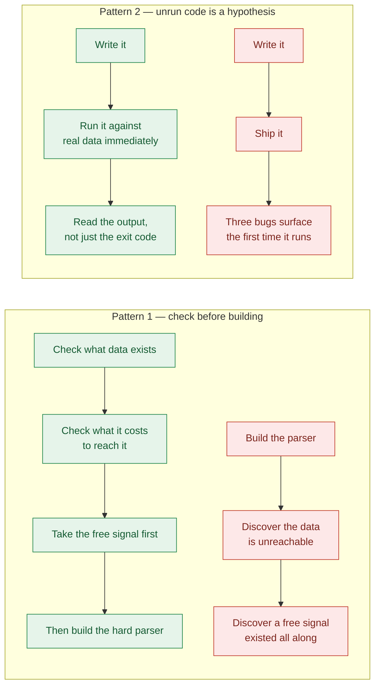
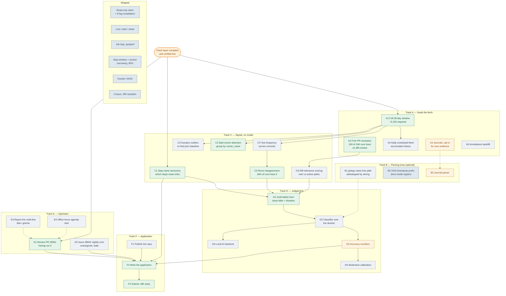

# Project map — where we've been, what we skipped, where we can go

A decision map for `podman-flake-agent`, built for
[LFX Mentorship: Agentic CI Flake Categorization and Analysis](https://github.com/podman-container-tools/podman/issues/29265).

Three graphs: how we got here, the patterns behind the mistakes, and everything
reachable from here. The wrong turns are in it on purpose — the shape of what got
skipped is the most useful part.

*Last updated after the dataset and labelling layer landed (`c8156d9`).*

> **This file stopped being current on 2026-08-03.** It still ranks more fetch
> and parsing work highly, which the replan that day reversed. It is kept as the
> record of *how* decisions were reached — the wrong turns in §2 are the useful
> part and do not expire. For what is done and what is next, read
> [`ROADMAP.md`](ROADMAP.md), which supersedes §4 and §5 below.

---

## 1. The route so far

```mermaid
%%{init: {"flowchart": {"curve": "basis"}}}%%
flowchart TD
    START(["Read the resume + the repo"])

    subgraph FRAME["Framing"]
        F1["Framed as: how to become<br/>a generic Podman contributor"]
        F2["Corrected: this is a specific<br/>AI/agent mentorship slot"]
    end

    subgraph RESEARCH["Research"]
        R1["Cirrus to GHA migration,<br/>May 2026"]
        R2["logformatter orphaned:<br/>keyed to CIRRUS_TASK_ID,<br/>invoked by nothing"]
        R3["PR 29091 open: Luap99<br/>rebuilding it by hand, in Python"]
        R4["CONTRIBUTING.md documents<br/>triage as a human reading<br/>a bar graph"]
    end

    subgraph BUILD["Prototype"]
        B1["parse / store / classify<br/>/ eval / report"]
        B2["DOM-nested parser"]
        B3["FAILED: div.tt wraps the<br/>whole log, not one test"]
        B4["Line-oriented parser<br/>76-93% reduction"]
    end

    subgraph CORPUS["Corpus"]
        C1["372 flakes issues harvested<br/>359 samples, 4 API calls"]
        C2["Reality check: 3 modern samples,<br/>median 8 lines, much of it<br/>not log data"]
        C3["Coverage split by suite:<br/>bats 96%, ginkgo 0%"]
    end

    subgraph FETCH["Fetch layer"]
        P1["Only journal logs exist today.<br/>Content needs auth: 401 / 403"]
        P2["Found job.steps: which step<br/>failed, free, no token"]
        P3["Read-only client built"]
        P4["Token added, ran it live<br/>for the first time"]
    end

    subgraph LIVE["What running it exposed"]
        L1["BUG: cross-host redirect<br/>leaked auth, broke every<br/>content download"]
        L2["Job logs beat journals:<br/>500KB per failed job,<br/>real ginkgo output"]
        L3["Step slicing alone only<br/>cut 24.8% -- the failing<br/>step IS the log"]
        L4["Two-stage narrowing:<br/>95.1%, ~4.2k tokens"]
        L5["BUG: PR attribution wrong<br/>in both directions"]
        L6["Dossier: one JSON<br/>per failed job"]
    end

    subgraph DATA["Dataset + labelling"]
        D1["One database: 492 runs,<br/>22,335 jobs, 153,425 steps"]
        D2["225 job logs<br/>620MB raw -> 67MB gzipped"]
        D3["Ground truth: 242 of 372<br/>issues have an identified fix"]
        D4["BUG: related_issues matched<br/>the JOB name, never the test --<br/>known_fixes always empty"]
        D5["BUG: windows unbounded by<br/>size -- 41,191 tokens"]
        D6["3 incompatible label<br/>identities; nothing could<br/>be scored"]
        D7["Label from evidence the<br/>classifier cannot see;<br/>blind the rest"]
    end

    NOW(["We are here"])

    START --> F1
    F1 -->|"user corrected"| F2
    F2 --> R1 --> R2 --> R3
    R2 --> R4
    R3 --> B1 --> B2 --> B3 --> B4
    B4 --> C1 --> C2 --> C3
    C3 --> P1 --> P2 --> P3 --> P4
    P4 --> L1
    P4 --> L2 --> L3 --> L4
    P4 --> L5
    L4 --> L6
    L5 --> L6
    L1 --> L6
    L6 --> D1 --> D2 --> D3
    D1 --> D4
    D2 --> D5
    D3 --> D6 --> D7
    D4 --> D7
    D5 --> D7
    D7 --> NOW

    classDef wrong fill:#fde8e8,stroke:#c0392b,color:#7b241c
    classDef good  fill:#e6f4ea,stroke:#1e8449,color:#145a32
    classDef key   fill:#fff0d9,stroke:#e67e22,color:#7e4a11
    classDef plain fill:#eef1f5,stroke:#7f8c9b,color:#2c3e50

    class F1,B2,B3,L1,L3,L5,D4,D5,D6 wrong
    class F2,B4,P3,L4,L6,D7 good
    class R2,R3,P2,L2,P4,D3 key
    class R1,R4,B1,C1,C2,C3,P1,D1,D2 plain
```

**Legend** — red: a wrong turn or a bug we had to back out of · green: a call that
held up · orange: a finding the project now rests on.

---

## 2. What held up, and what didn't

| Call | Verdict | Why it mattered |
|---|---|---|
| Read real CI logs before designing any prompt | **Right** | Produced the empty-timeline and shared-helper findings. No amount of API reading gets those. |
| Line-oriented parsing over DOM nesting | **Right** | `div.tt` opens once around the whole output; the ginkgo failure summary sits outside the timeline divs. |
| Verified claim status before recommending issues | **Right** | #28826 was assigned to Tim Zhou — a mentor. |
| Refused to claim a bug in Luap99's PR | **Right** | The tag bug was in *our* parser. His uses `html.parser`, which handles it correctly. |
| Read-only by construction, not by discipline | **Right** | One GET path, no method argument. Later paid off again: the redirect fix also stopped leaking the token to Azure. |
| Checkpoints instead of building straight through | **Right** | Turned "raw vs HTML mismatch" into "one conditional, 71 samples". |
| **Checked the log window's *content*, not just that it ran** | **Right** | The first version looked fine by line count but had lost the timeout anchor and pulled in 70 lines of `chmod`/`rm` cleanup. |
| Built the log parser before checking `job.steps[]` | **Missed** | Step attribution answers most of infra-vs-test for free. Did the hard 20% first. |
| Didn't check auth requirements early | **Missed** | Wrote artifact ingestion against endpoints returning 401/403. |
| Didn't check what artifacts live CI emits | **Missed** | Built an HTML parser when today's only artifact is a raw journal. |
| Assumed the fixtures were representative | **Missed** | All 2023 Cirrus-era; 2026 GHA prefixes every line with a timestamp. |
| Took "42 flakes issues" at face value | **Missed** | Open-only. The real corpus is 372. |
| **Shipped `--download` without ever running it** | **Missed** | It had never worked. Cross-host redirect → 401 on every content fetch. |
| **Trusted `run["pull_requests"]` without verifying** | **Missed** | Gave PR #10 for a commit titled "Merge pull request #29344", attaching a stranger's diff to an unrelated failure. |
| **Wrote "turns 513KB into a few KB" into a plan** | **Missed** | Step slicing alone gave 24.8%. The claim was written before anything measured it. |
| Claimed rerun-disagreement "may fire almost never" | **Missed** | Based on 5 sampled runs. Real figure: **18% of runs** have `run_attempt` > 1, up to attempt 5. |
| **Matched issues against the CI job name** | **Missed** | `"macos machine applehv"` shares no word with any issue title, so `related_issues` returned zero every time and `known_fixes` was permanently empty. The failing *test* name matches real issues. Caught before generating 400 dossiers with the field dead. |
| **Bounded log windows by lines, not characters** | **Missed** | Raw GHA logs don't fold podman's twelve repeated flags the way logformatter's HTML does, so 900 lines came to 41,191 tokens. The first fix then missed the no-anchor fallback path — four windows stayed at 22k–41k. |
| **Built labelling and scoring on three different identities** | **Missed** | `labels` wrote `issue:N`, `eval` joined `test_failures.fkey` (0 rows), a dossier is a job id. Nothing could ever have been scored. |
| **Checked the date distribution before reporting a finding** | **Right** | A step failing 30 times on an open PR read as a live bug; all 30 were the day it opened, fixed within 24 hours. Would have meant telling a mentor about a month-old bug. |

### Two patterns, not one

The first three misses share one cause: **building before checking what data exists
and what it costs.** The last three share a different one: **every claim that had
never been executed was wrong.** The redirect bug, the PR field, and the
"few KB" estimate all survived review and a written plan, and all three died within
minutes of the first real run.

---

## 3. Paths not taken

| Path | Why declined | Still viable? |
|---|---|---|
| Shell out to `hack/ci/logformatter` (Perl) | Two of three suites parse raw text already; and step-window slicing removed the need entirely | Only if journals become primary |
| Journals as the primary content source | 32MB per run vs 500KB per failed job, and job logs carry the same ginkgo output | Yes, for systemd-level race evidence |
| Become a general Podman contributor instead | Doesn't demonstrate what this slot asks for | Yes, as a complement |
| Target `containers/ramalama` instead | Better stack fit, no mentorship attached | Yes, as a fallback |
| Fix the flakes themselves | Deep Go/systems bugs — checkpoint/restore, netavark, WSL | Not in the timeline |
| Scrape the Actions web UI | Fragile, rude, against the spirit of a read-only client | **No** |

---

## 4. Everything reachable from here

**Grey:** already shipped · **Green:** high value, do next · **Grey-blue:** worth
doing, no urgency · **Amber:** expensive or blocked on something upstream of it.

---

## 5. Reading the graph

### Track B mostly evaporated

The ginkgo parser at 0% coverage was the headline problem two slices ago. Step-window
slicing plus failure-marker anchoring gets the failure text out **without parsing the
suite at all** — no CSS classes, no era dependence, works on ginkgo, bats and Python
alike. `B1` is now optional rather than blocking, and `B2` landed inside `logslice`.

That is the second time a cheap structural signal replaced an expensive parsing
problem. Worth remembering as a prior.

### `A2` is the newest gap and it is load-bearing

Diff context is one of the strongest flake signals available — PR #29344 changed only
`CONTRIBUTING.md` and a PR template, and a macOS VM test timed out on it. A docs-only
diff cannot do that. But **160 of 184 runs are fork PRs with no resolvable number**,
so that signal is missing for most failures. `/commits/{sha}/pulls` returns empty
because the head commit isn't in the base repo.

### Track D is finally unblocked

The dossier is the input a classifier needs, and it now exists. `D1` (gold labels) is
the only thing between here and the first real accuracy number — and an accuracy
number is what separates this from a pile of plumbing.

### Track E still has the only external clock

PR #29091 is open now. Reviewing it having actually run it is worth more than more
private code, and it expires on merge.

### If only three things happen

`A1` is done — the 30-day window is fetched and the dataset exists. What remains:

1. **Read ~20 issues with their fixes.** Not for labels — to find out whether the
   six categories are the right six. Thirty minutes, no code.
2. **Label 30–50 dossiers** from independent evidence, then blind it. This is the
   only thing standing between the project and an accuracy number.
3. **`E1`** — review PR #29091. Still the only item with an external clock.

### Still deliberately not on this map

Anything that writes to Podman: filing issues, posting PR comments, opening PRs.
The client is GET-only by construction and `report.py` has no `--post` flag.

---

## 6. State as of this map

| | |
|---|---|
| Commits | prototype `d95e9af` → fetch layer `f301021` → dataset `f65e56c` → labelling `c8156d9` |
| Data on disk | **492 runs · 22,335 jobs · 153,425 steps · 225 job logs · 1,928 fix commits · 372 issues** |
| Dossiers | 400 generated · 5 committed as offline fixtures |
| Ground truth | **242 of 372 issues (65%)** have an identified fix |
| Log narrowing | median **1,336 tokens**, max 11,979, bounded by lines *and* characters |
| Attribution | failing step identified on **100%** of dossiers, no log required |
| Parser | bats 96–100% · ginkgo 0% · **bypassed entirely by `logslice`** |
| Blocking | Fork-PR diff context missing for ~80% of PR runs |
| Accuracy | **Still none measured.** The harness now works; the labels are the user's to make. |
