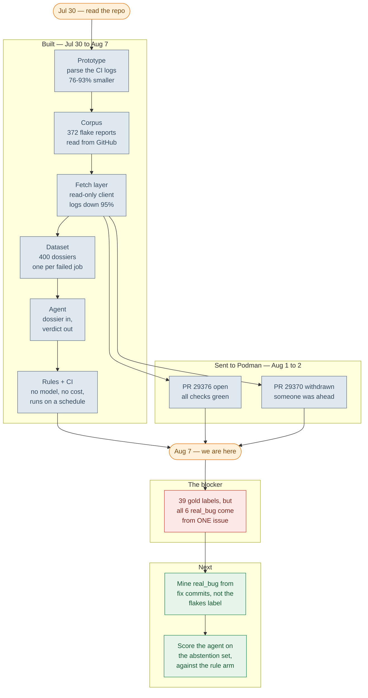
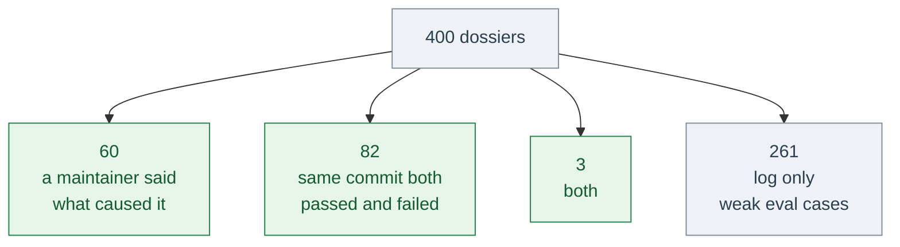

# Roadmap

What shipped, where the project stands, and what is worth doing next — in the
order that unblocks the most.

New to the vocabulary? **[`GLOSSARY.md`](GLOSSARY.md)** explains every term used
here — flake, dossier, blinding, gold label, and the rest — in plain language.

`MAP.md` is the companion to this file and answers a different question: *how*
decisions were reached, including the wrong turns. This file is the timeline and
the forward plan.

*State as of 2026-08-07. Dates are commit dates.*

---

## 1. The whole thing at a glance

**Grey** = shipped · **red** = the blocker · **green** = what's next.

---

## 2. What each phase actually produced

```mermaid
flowchart LR
    subgraph IN["What goes in"]
        A1["A GitHub Actions run<br/>that failed"]
    end
    subgraph MID["What this project does to it"]
        B1["Find which STEP failed<br/>no log reading needed"]
        B2["Cut the 500 KB log<br/>down to the failure<br/>~95% smaller"]
        B3["Gather evidence<br/>the log cannot show<br/>reruns, history, the diff"]
        B4["Write it as one<br/>JSON file: a DOSSIER"]
    end
    subgraph OUT["What comes out"]
        C1["Hide the evidence<br/>a human labels from<br/>= BLINDING"]
        C2["Ask a model:<br/>why did this fail?"]
        C3["Check its quotes<br/>are really in the log"]
        C4["Score it against<br/>hand-made GOLD LABELS"]
    end

    A1 --> B1 --> B2 --> B3 --> B4 --> C1 --> C2 --> C3 --> C4

    classDef done fill:#dfe7ef,stroke:#5d6d7e,color:#34495e
    classDef gap  fill:#fde8e8,stroke:#c0392b,color:#7b241c
    class A1,B1,B2,B3,B4,C1,C2,C3 done
    class C4 gap
```

Everything grey is built and runs today. **Only the last box is missing**, and it
is missing because it needs human judgement, not more code.

| Phase | Date | What shipped | What broke, and was fixed |
|---|---|---|---|
| 0 · framing | Jul 30 | Established the premise: Podman left Cirrus CI in May 2026, orphaning `logformatter`, so flake triage reverted to a human reading a bar graph | Started as "become a Podman contributor", corrected to "this is an AI/agent slot" |
| 1 · prototype | Jul 30 | `parse / store / classify / eval / report`; **76–93%** log reduction | First parser nested on the DOM. `div.tt` opens once around the *whole* output, not per test. Rebuilt line-oriented |
| 2 · corpus | Jul 30 | 372 flake reports, 359 samples | Only 3 modern samples; parser coverage split **bats 96% / ginkgo 0%** |
| 3 · fetch | Jul 30 | Read-only client, ETag-cached; two-stage narrowing to **95.1%** | First live run found 3 bugs in an hour, incl. a redirect leaking the token to Azure |
| 4 · dataset | Jul 31 | 492 runs · 22,335 jobs · 153,425 steps · 400 dossiers | Issue matching used the *job* name, so the fix field was always empty; labels and scores used 3 incompatible IDs — nothing could ever have been scored |
| 5 · upstream | Aug 1–2 | PR #29376 open and green; #29370 withdrawn as a duplicate | — |
| 6 · agent | Aug 3 | `taxonomy.py`, `agent.py`, published repo | `fetch.py:548` stored the word `"referenced"` where the commit message belonged — **1,593 of 1,928 rows** |
| 7 · measured | Aug 4 | 39 gold labels, two model arms, `baselines.py`, `RESULTS.md` | The gold set failed its own audit: all 6 `real_bug` labels are one issue, and `history.failure_rate >= 0.19` scores **92%** with no model and no log |
| 8 · rules + CI | Aug 5 | `triage.py`, both workflows, `LICENSE`; a cold 2-day run is **185s / ~100 requests** locally, inside a 10-minute limit | The first pattern set matched `/journald?/` and fired on **21 of 23** failures — every job uploads a `journal-*.log` artifact. And HANDBOOK's claim that step names "resolve a large share of triage" was wrong once counted: **2.8%** |
| 9 · live | Aug 7 | Both workflows green on GitHub. `triage` run 1: **58s**, 29 dossiers, 17 triaged, 3 `infra_blip`, **82% abstention** — the same rate as the local window, on a corpus it had not seen | The 185s local figure was almost all round-trip latency; a runner talking to GitHub's own API does the same work in a third of the time. Quoting a laptop measurement as a CI budget was the mistake |

---

## 3. Where it stands

| | |
|---|---|
| Code / docs | 5,468 lines across 16 modules · 2,599 lines in `docs/` |
| Data | 492 runs · 22,335 jobs · 153,425 steps · 225 job logs · 372 issues |
| Dossiers | 400 generated · 5 committed as offline fixtures |
| Offline tests | `test_parse`, `test_steps`, `test_agent`, `test_triage` — all passing, no token needed |
| CI | `tests.yml` (offline, every entry point) · `triage.yml` (scheduled, 10-minute cap) |
| Upstream | 1 of 2 permitted open PRs in use |
| **Gold labels** | **39** — and [audited](RESULTS.md#6-the-gold-set-cannot-support-a-real_bug-claim-at-all): one issue supplies all 6 `real_bug` labels |
| **Accuracy** | 29% (`gpt-oss-120b`) · 19% (`gpt-oss-20b`) · 0% + 100% abstention (rules) · **85% constant, 92% one-float baseline** |

**139 of 400 dossiers can be labelled without reading a log:**

The backfill moved the first group from 45 to 60. Worth stating plainly: three
quarters of the fix commit IDs return HTTP 422 — they belong to forks, or to
history that moved — so **60 of 400 is what the linkage actually supports.** Not
a solved labelling problem.

**The blocker, restated after measuring.** It is no longer that labels do not
exist — 39 do. It is that they cannot carry the weight put on them: 33
`race_condition`, 6 `real_bug` from a single issue, and no examples at all of the
three infrastructure classes. An accuracy number on this set describes the set.

---

## 4. What is actually next

Ordered by what unblocks the most. Nothing here is a scheduling problem; the
first item gates the interpretation of every number the project can produce.

**1. Fix the gold set, or stop quoting accuracy.**
All six `real_bug` labels come from one issue, so the effective sample size for
that class is 1, and a single float — `history.failure_rate >= 0.19` — scores 92%
without a model or a log ([RESULTS.md §6](RESULTS.md#6-the-gold-set-cannot-support-a-real_bug-claim-at-all)).
`real_bug` examples cannot be mined from the `flakes` label, because real bugs
are not filed as flakes. They need a different source: failures on PRs whose
merged fix touched the code under test. That is a mining path, not more
labelling effort on the current one.

**2. Work the abstention set, not the corpus.**
The rule layer resolves the infrastructure classes and abstains on the rest — 82%
of a live window ([RESULTS.md §7](RESULTS.md#7-the-rule-layer-abstains-on-all-39-and-that-is-the-informative-part)).
Those abstentions are where a model has to earn its cost, and they are a
directory of files rather than an opinion. Any agent work should be scored on
that subset and against the rule arm, not against the majority class.

**3. Fork-PR diff resolution.**
Whether the change under test could plausibly have caused the failure is among
the strongest signals available, and it is missing for ~80% of PR runs because
GitHub does not report the PR association for commits living in a fork. See
[FETCH_AUDIT.md](FETCH_AUDIT.md).

**4. Better issue-to-test matching.**
The dossier calls the current lexical overlap *"a starting point, not a
duplicate determination"*, and it means it: 24 of 89 matches are on the job name,
a path [MAP.md](MAP.md) already identified as broken. 1,196 fix links are still
placeholders.

**5. Ginkgo.**
HTML parsing is 0% on the real corpus. Step-window slicing routes around it
rather than solving it, which is fine until something needs per-test structure
inside a ginkgo run — deduplication against known flakes does.

**6. Local models.**
`--backend ollama` exists and has never been run against the gold set.

**7. Sit downstream of [#29091](https://github.com/podman-container-tools/podman/pull/29091)**
once it merges, rather than alongside it.

**8. The write path — last, and only by agreement.**
Nothing in this package can post to GitHub: one GET path, no method argument, no
`--post` flag. Filing issues or commenting on PRs against a real repository is
not a feature to be switched on quietly. It is the point at which a wrong verdict
starts costing other people time, and it should be turned on deliberately, with
whoever owns that CI, or not at all.
