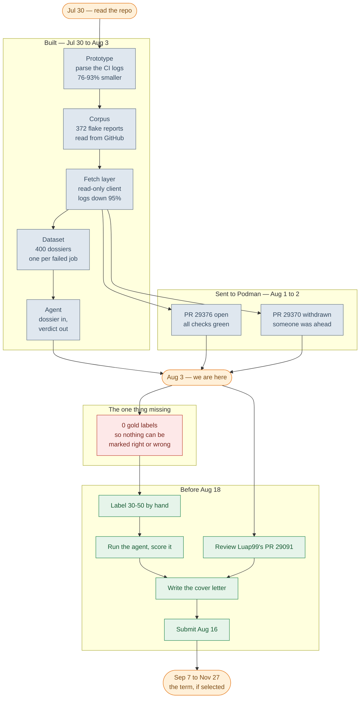
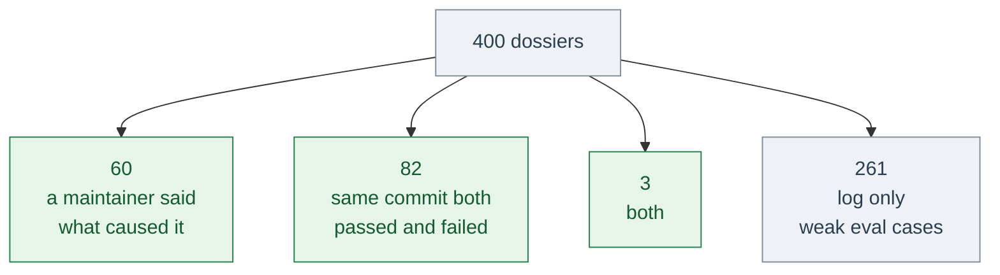
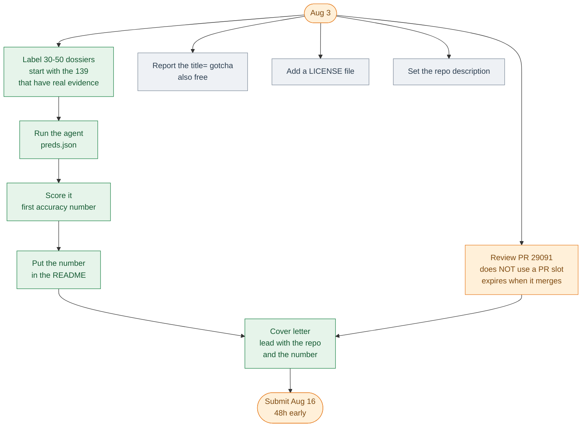

# Roadmap — origin to project end

One sequence, start to finish: what shipped, where the project stands today, and
what remains between here and the last day of the mentorship term.

New to the vocabulary? **[`GLOSSARY.md`](GLOSSARY.md)** explains every term used
here — flake, dossier, blinding, gold label, and the rest — in plain language.

`MAP.md` is the companion to this file and answers a different question: *how*
decisions were reached, including the wrong turns. This file is the timeline and
the forward plan.

*State as of 2026-08-03. `Done` dates are commit dates; term dates are LFX's
published calendar.*

---

## 1. The whole thing at a glance



**Grey** = shipped · **red** = the blocker · **green** = what's next · **amber** = milestones.

---

## 2. What each phase actually produced

```mermaid
flowchart LR
    subgraph IN["What goes in"]
        A1["A GitHub Actions run<br/>that failed"]
    end
    subgraph MID["What this project does to it"]
        B1["Find which STEP failed<br/>no log reading needed"]
        B2["Cut the 500 KB log<br/>down to the failure<br/>~95% smaller"]
        B3["Gather evidence<br/>the log cannot show<br/>reruns, history, the diff"]
        B4["Write it as one<br/>JSON file: a DOSSIER"]
    end
    subgraph OUT["What comes out"]
        C1["Hide the evidence<br/>a human labels from<br/>= BLINDING"]
        C2["Ask a model:<br/>why did this fail?"]
        C3["Check its quotes<br/>are really in the log"]
        C4["Score it against<br/>hand-made GOLD LABELS"]
    end

    A1 --> B1 --> B2 --> B3 --> B4 --> C1 --> C2 --> C3 --> C4

    classDef done fill:#dfe7ef,stroke:#5d6d7e,color:#34495e
    classDef gap  fill:#fde8e8,stroke:#c0392b,color:#7b241c
    class A1,B1,B2,B3,B4,C1,C2,C3 done
    class C4 gap
```



Everything grey is built and runs today. **Only the last box is missing**, and it
is missing because it needs human judgement, not more code.

| Phase | Date | What shipped | What broke, and was fixed |
|---|---|---|---|
| 0 · framing | Jul 30 | Established the premise: Podman left Cirrus CI in May 2026, orphaning `logformatter`, so flake triage reverted to a human reading a bar graph | Started as "become a Podman contributor", corrected to "this is an AI/agent slot" |
| 1 · prototype | Jul 30 | `parse / store / classify / eval / report`; **76–93%** log reduction | First parser nested on the DOM. `div.tt` opens once around the *whole* output, not per test. Rebuilt line-oriented |
| 2 · corpus | Jul 30 | 372 flake reports, 359 samples | Only 3 modern samples; parser coverage split **bats 96% / ginkgo 0%** |
| 3 · fetch | Jul 30 | Read-only client, ETag-cached; two-stage narrowing to **95.1%** | First live run found 3 bugs in an hour, incl. a redirect leaking the token to Azure |
| 4 · dataset | Jul 31 | 492 runs · 22,335 jobs · 153,425 steps · 400 dossiers | Issue matching used the *job* name, so the fix field was always empty; labels and scores used 3 incompatible IDs — nothing could ever have been scored |
| 5 · upstream | Aug 1–2 | PR #29376 open and green; #29370 withdrawn as a duplicate | — |
| 6 · agent | Aug 3 | `taxonomy.py`, `agent.py`, published repo | `fetch.py:548` stored the word `"referenced"` where the commit message belonged — **1,593 of 1,928 rows** |
| 7 · measured | Aug 4 | 39 gold labels, two model arms, `baselines.py`, `RESULTS.md` | The gold set failed its own audit: all 6 `real_bug` labels are one issue, and `history.failure_rate >= 0.19` scores **92%** with no model and no log |
| 8 · rules + CI | Aug 5 | `triage.py`, both workflows, `LICENSE`; a cold 2-day run is **185s / ~100 requests**, inside a 10-minute limit | The first pattern set matched `/journald?/` and fired on **21 of 23** failures — every job uploads a `journal-*.log` artifact. And HANDBOOK's claim that step names "resolve a large share of triage" was wrong once counted: **2.8%** |

---

## 3. Where it stands

| | |
|---|---|
| Code / docs | 5,468 lines across 16 modules · 2,599 lines in `docs/` |
| Data | 492 runs · 22,335 jobs · 153,425 steps · 225 job logs · 372 issues |
| Dossiers | 400 generated · 5 committed as offline fixtures |
| Offline tests | `test_parse`, `test_steps`, `test_agent`, `test_triage` — all passing, no token needed |
| CI | `tests.yml` (offline, every entry point) · `triage.yml` (scheduled, 10-minute cap) |
| Upstream | 1 of 2 permitted open PRs in use |
| **Gold labels** | **39** — and [audited](RESULTS.md#6-the-gold-set-cannot-support-a-real_bug-claim-at-all): one issue supplies all 6 `real_bug` labels |
| **Accuracy** | 29% (`gpt-oss-120b`) · 19% (`gpt-oss-20b`) · 0% + 100% abstention (rules) · **85% constant, 92% one-float baseline** |

**139 of 400 dossiers can be labelled without reading a log:**



The backfill moved the first group from 45 to 60. Worth stating plainly: three
quarters of the fix commit IDs return HTTP 422 — they belong to forks, or to
history that moved — so **60 of 400 is what the linkage actually supports.** Not
a solved labelling problem.

**The one blocker.** Everything else is built. `gold_labels` is empty, so nothing
the agent produces can be scored, and every number in the README is still a size
measurement rather than a claim about being right.

---

## 4. Ahead — to the application, Aug 3 → Aug 18

Podman weights this differently from most projects, per
[@Luap99 on #29265](https://github.com/podman-container-tools/podman/issues/29265):
contributions are **not required**, the cover letter and resume are what get
read, *"that can also be some personal project"*, and there is a hard cap of two
open PRs. **So this repo is the artifact, and more PRs are not the lever.**



1. **Label 30–50 dossiers.** The only thing between here and an accuracy number.
   `labels show --dossier` leads with the independent evidence and puts the log
   last. Decide from the top — if you need the log to decide, it is a weak case.
2. **Run and score.** `agent.py` → `preds.json` → `eval.py dossiers`. Report
   abstention beside accuracy. Replace the README's *"No accuracy numbers"*
   bullet, keeping the statement of what it does and does not cover.
3. **Review [PR #29091](https://github.com/podman-container-tools/podman/pull/29091)**
   having run it. Reviews do not consume the 2-PR budget. Your findings here are
   not available to anyone who has not parsed real output. **The only item with
   an external clock — it expires on merge.**
4. **Report the multi-line `title=` gotcha** — logformatter folds the podman
   command line into an HTML attribute containing newlines, so one tag spans many
   lines. Cost ~11% of the ginkgo reduction until fixed.
5. **Cover letter, submitted Aug 16.**

### Small and visible

- ~~**No `LICENSE` file.**~~ Added Aug 5 — Apache-2.0, matching Podman's own.
- **No repository description** set on GitHub. Not something a commit can fix.
- **`PODMAN_READ_TOKEN` is not set**, so `triage.yml` runs in its offline mode
  until a read-only token is added under Settings → Secrets → Actions.
- `HANDBOOK.md` §11 and `MAP.md` §5 still rank more fetch work highly. Both
  predate the Aug 3 replan and now contradict this file.

### Not doing before Aug 18

Tracks A, B and C from `MAP.md`, including A2 (fork-PR diff context, ~80% of PR
runs). A2 is load-bearing for the *tool*, not the *application*.

---

## 5. Ahead — the term, if selected

| Date | |
|---|---|
| **Aug 18, 00:00 UTC** | **applications close — so in practice, the end of Aug 17.** This project's `applicationEndDate` is 1787011200, not the 23:59:59 that most LFX projects use; the UX project on the same term does close at 23:59:59. Do not read one project's deadline off another's |
| Sep 2–4 | selections announced |
| Sep 7 | term begins |
| Oct 20 / Oct 21 | midterm evaluation / first stipend |
| Nov 24 / Nov 25 | final evaluation / second stipend |
| Nov 27 | last day |

The four rows below the deadline come from the LFX program-wide calendar. The
project's own `programTerms` record disagrees with them — it gives **Sep 15 →
Nov 15** — and the same gap exists on the UX project, so it is a property of how
LFX stores terms rather than something specific here. Only the application
deadline is worth treating as exact, and it was re-read from the API on Aug 7:

```bash
curl -s https://api.mentorship.lfx.linuxfoundation.org/projects/050e89d9-aec2-47ad-9113-3ba41a639d55 \
  | python3 -c 'import sys,json,datetime; t=json.load(sys.stdin)["programTerms"][0]; \
    print(datetime.datetime.fromtimestamp(t["applicationEndDate"], datetime.timezone.utc))'
```

**Applications are open.** The term's `active` field reads `"open"` and Aug 7
sits inside the window. The project object also carries `acceptApplications:
false`, which is not about this — it sits beside `amountRaised`,
`totalDonations` and `menteeStatus`, and the UX project reports the same value
while accepting applications too. `programTerms[0].active` plus the date window
is the pair to read; `acceptApplications` is a false lead.

Work that becomes worth doing once there is a mentor to agree the shape with:

- **Fork-PR diff resolution.** Whether the code change could even have caused the
  failure is among the strongest signals, and it is missing for ~80% of PR runs
  because GitHub does not report the PR for commits that live in a fork.
- **The remaining 1,196 placeholder fix links**, and a better issue-to-test match
  than word overlap — the dossier itself calls the current one *"a starting
  point, not a duplicate determination"*, and 24 of 89 matches are on the job
  name, the path `MAP.md` already identified as broken.
- **Local-model results.** `--backend ollama` exists and is untested against the
  gold set; issue #29265 names local AI as a plus.
- **Sit downstream of #29091 for real**, once it merges, rather than alongside it.
- **The write path.** Nothing in this package can post to GitHub — one GET path,
  no `--post` flag. Filing or commenting is a deliberate, mentor-agreed step.

⚠️ The LFX listing read *"This program is pending approval!"* and could not be
confirmed programmatically. If the project does not run, the repo still stands on
its own and the two CI PRs are unaffected.
